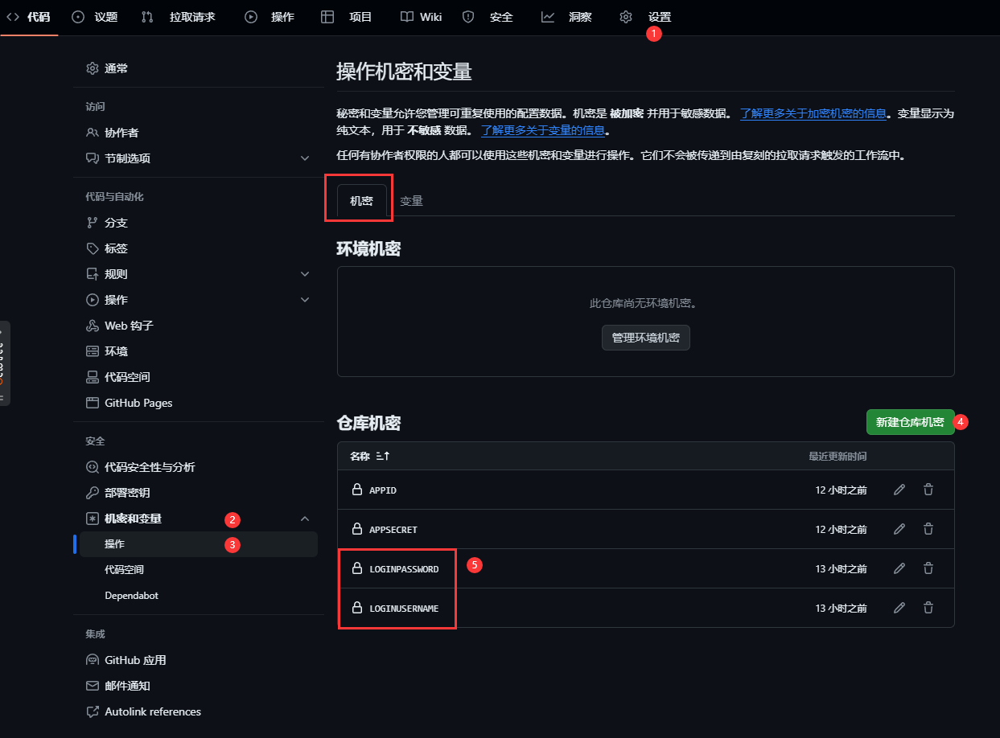
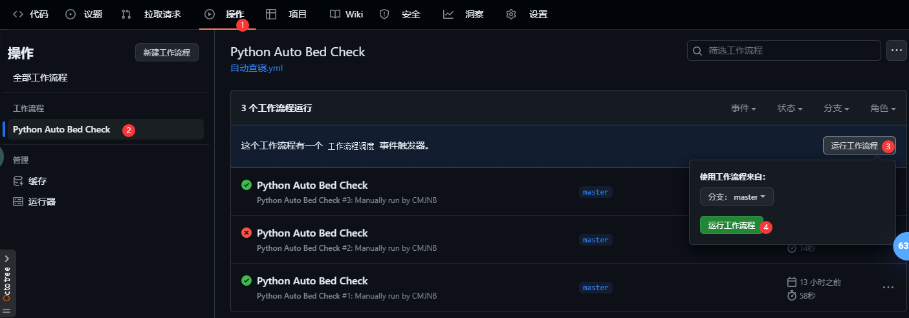

# 广州理工学院 查寝脚本

## 介绍

这是一个用于[广州理工学院查寝](https://xsfw.gzist.edu.cn/xsfw/sys/swmzncqapp/*default/index.do)的脚本，可以搭配其他工具自动完成查寝任务。

## 使用方法

> 账号密码是指[统一身份验证系统](https://ids.gzist.edu.cn/lyuapServer/login)的账号密码，账号为```学号```，默认密码为```身份证后六位```

> ⚠️ **警告**: 使用此脚本前必须修改默认的密码。

1. 下载本仓库所有文件，把所有文件放到一个文件夹中
2. 安装Python3
3. 进入文件夹，打开命令行
3. 安装依赖
   ```pip install -r requirements.txt```
4. 执行脚本
   ```python main.py [-e|-c <config path>|-u <username> -p <password>]```

### 参数说明：

```-e```,```--env```从环境变量中获取用户名和密码

```-c```,```--config``` 读取配置文件获取用户名和密码

```-u```,```--username```命令行输入用户名

```-p```,```--password```命令行输入密码

优先级：```-e```>```-c```>```-u```

## 使用GitHub Actions自动查寝：
先fork本仓库，然后在仓库的Settings->Secrets中添加名为```LOGIN_USERNAME```和```LOGIN_PASSWORD```的secret，分别存储用户名和密码。

然后在仓库的Actions中手动运行，即可测试运行是否正常。
